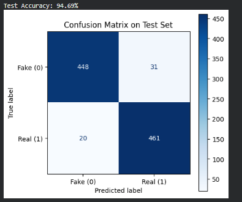

This project focuses on detecting deepfake media across 3 modalities:
Deepfake Images
Deepfake Audio
Deepfake Videos
The goal is to build ML models capable of classifying whether the input is REAL or FAKE with high accuracy. 
A combination of Computer Vision, Speech Processing, and Deep Learning techniques is used.

Language: Python

dataset used: 
Dataset used: Three-Body Dataset (Kaggle)  https://www.kaggle.com/datasets/ameencaslam/three-body-dataset

to install requirements:
pip install -r requirements.txt

Model Architecture:
A pretrained Xception CNN to extract 2048-dimensional features from video frames, 
followed by a two-layer LSTM with dropout to capture temporal patterns. 
The final fully connected layers classify each video as FAKE or REAL, handling variable-length sequences efficiently.

confusion matrix:

